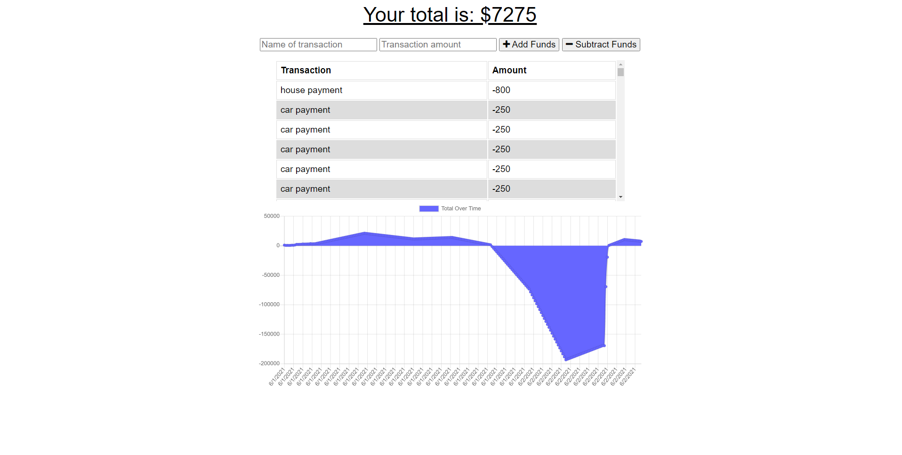

# Budget-Tracker

  The Budget Tracker allows users to enter in expenses and then displays their total as well as a graph of the information. This application works both online and offline.
  
  ## Table of Contents
  
  - [Technologies](#technologies)
  - [Screenshots](#Screenshots)
  - [Dependencies](#dependencies)
  - [Contributing](#contributing)
  - [Deployed](#Deployed)
  
  ## Technologies

    * IndexedDB
    * Node.js 
    * Express
    * MongoDB/Mongoose
  
  
  ## Screenshots

  
  ## Dependencies

    * To install dependencies, enter npm i
  
  ## Contributing

  GitHub: https://github.com/bHutchingson

  ## Deployed

  https://rocky-peak-05306.herokuapp.com/